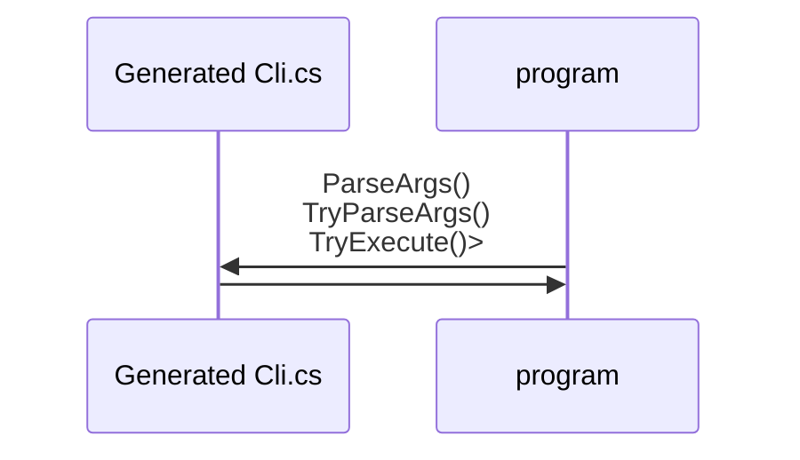
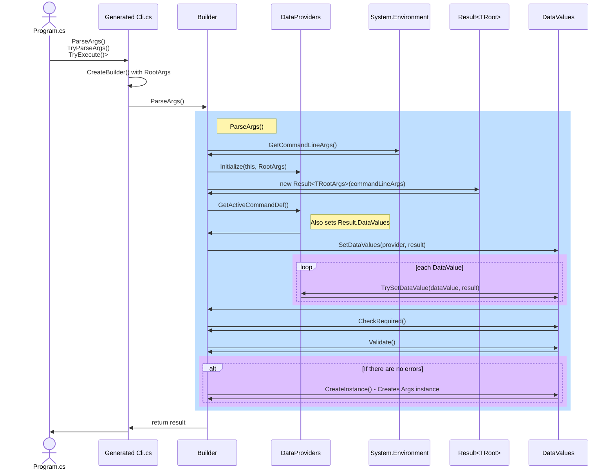

# Default design

```mermaid
sequenceDiagram
    participant cli as Generated Cli.cs

    program->>cli: ParseArgs()<br/>TryParseArgs()<br/>TryExecute()>
   
    cli->>program:

```

```mermaid
sequenceDiagram
    actor program as Program.cs
    %%participant Alice@{ "type" : "collections" }
    participant cli as Generated Cli.cs
    participant builder as Builder
    %%participant rootArgs as RootArgs
    participant providers as DataProviders
    participant env as System.Environment
    participant result as Result<TRoot>
    participant dataValues as DataValues

    program->>cli: ParseArgs()<br/>TryParseArgs()<br/>TryExecute()>
    cli->>cli: CreateBuilder() with RootArgs
    cli->>builder: ParseArgs()
    rect rgb(191, 223, 255)
    note right of builder:ParseArgs()
    builder->>env: GetCommandLineArgs()
    env->>builder: 
    builder->>providers: Initialize(this, RootArgs)
    builder->>result: new Result<TRootArgs>(commandLineArgs)
    result->>builder:
    builder->>providers: GetActiveCommandDef()
    note right of providers: Also sets Result.DataValues
    providers->>builder:
    builder->>dataValues: SetDataValues(provider, result)
    rect rgb(221, 191, 255) 
    loop each DataValue
    dataValues->>providers: TrySetDataValue(dataValue, result)
    providers->>dataValues:
    end
    end
    dataValues->>builder:

    builder->>dataValues: CheckRequired()
    dataValues->>builder:

    builder->>dataValues: Validate()
    dataValues->>builder:

    rect rgb(221, 191, 255) 
    alt If there are no errors
    builder->>dataValues: CreateInstance() - Creates Args instance
    dataValues->>builder:

    end
    end
    end
    builder->>cli: return result
    cli->>program:

```
