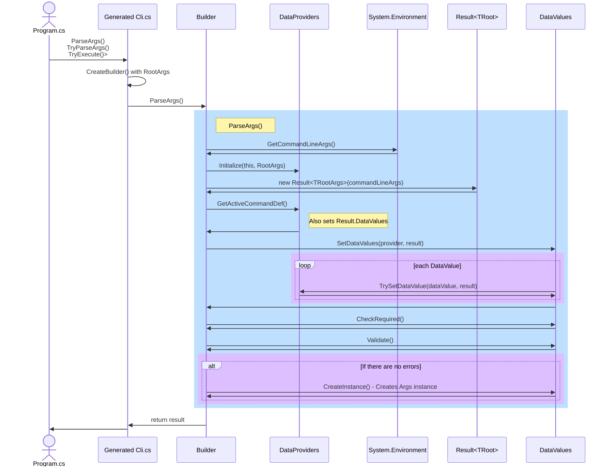

# High-level design

_For an explanation of usage, see the repo's [ReadMe.md](..\ReadMe.md)_

A high level walk through would be:

- Information is extracted from the implementing programmer's Args class to generate strongly typed files in the program's space that allow data gathering, validation, and instantiation of a validated instance of the Args class.
- Data gathering is done with an open set of data providers. DragonFruit2 will include at least a System.CommandLine data provider and a data provider for default values.
- Default values are handled as data providers.
- Checking for required values must occur after all data providers have completed and before any validation is done, so is a separate process.
- Validation is done via validators against data values, prior to instantiation. Implementing programmers can declare criteria via attributes or registration.
- Instantiation is via a generated constructor that takes all the gathered properties as parameters.
- _DragonFruit2 relies on Roslyn Code generation and the args class must be a partial class. It does **not** run during design time generation, only full generation._

There are three owners: parts of the system are owned by the implementing programmer, parts by the DragonFruit2 generator, and parts by the DragonFruit2 libraries. The generator is considered a separate owner because it is not designed to be extensible and it's artifacts are in the app. Also, it's a separate project in the same package.

There are three realms, and realms is not the right word, extent seems odd, and scope might be misleading. For each entity, there is a clear boundary at either the run (this call), the app via `RootArgs`, or the ecosystem. This is harder to explain than intuit; elements can be the library, the definitions associated with this `RootArgs` class, or the data associated with this particular call to `ParseArgs`. `TryParse` and `TryExecute` are wrappers on `ParseArgs`.

## The top level elements

| Element             | Owner              | Realm     | Responsibility                          |
|---------------------|--------------------|-----------|-----------------------------------------|
| Entry point         | Programmer(*)      | Run       | The call that initiates the run         |
| Args class          | Programmer(*)      | Run       | Defines data and holds result           |
| Args class partial  | Generator          |           | Declares constructor                    |
| `DataDefinition`    | Generator          | RootArgs  | Contains entire definition              |
| `DataValues`        | Generator          | Run       | Holds data and diagnostics for run      |
| `Builder`           | DragonFruit2       | RootArgs  | Orchestrates the run within `ParseArgs` |
| `DataProviders`     | DragonFruit2       | RootArgs  | After initialization, gathers data      |
| `Validators`        | DragonFruit2, etc. | Ecosystem | Simple and complex validations          |

(*) _Programmer_ indicates the implementing programmer in this table

The `DataDefinition` includes subdefinitions corresponding to properties and subcommands (derived classes).

Similarly, `DataValues` includes a `DataValue` collection. `DataValues` always corresponds to the active command that the end user requested.

### Sequence diagram

## A little more detail

### Startup

Switching the call from the library (needed for initial discovery) to the typed `Bulder<TRootArgs>` requires a little parlor trick. The sleight of hand depends on types in the current assembly being preferred over those in other namespaces. There is a little quirk with the `using` statement being required to start, and then marked as unnecessary. This occurs in the generated `Cli.cs` file.

_To find the generated files in VS: in Solution Explorer, open dependencies/analyzers/DragonFruit2.Generators/DragonFruit2.Generators.DragonFruit2Generator_

### Root and active Args

The `TRootArgs` is the root of the command hierarchy. The active command is the one the user requested. There can only be one active command and one root command. In a single level CLI, they are always the same.

Subcommands derive from `TRootArgs`, so the active command is always also a `TRootArgs`. This is used heavily internally, and also the return value is always a `TRootArgs`.

Data providers may implement `IActiveArgsProvider`. If the implementation is present, it is queried to find the active args. This avoids making the System.CommandLine special, and supports future alternate parsers (_wat!!!_) and scripting which my intuition thinks will arise as easier for humans than AI generating unfamiliar command line text. First one wins, and there is currently no support for a different priority order for finding the active args and finding data. It is not clear if a similar `IDataProvider` is appropriate - we do not have a scenario for an `IActiveArgsProvider` providing data at a different priority than it provides the active args.

