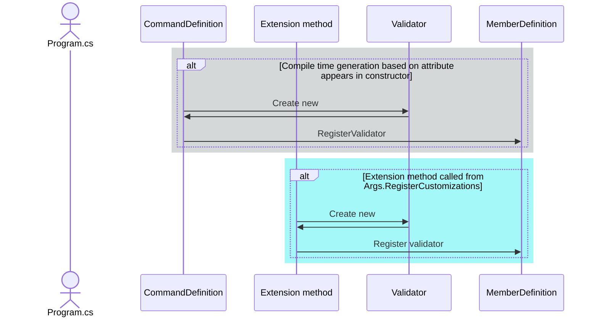

# Design confirmation

Validation serves two important purposes: ensuring data is valid before it is used, and providing metadata to humans and AI as instructions for proper usage. The second purpose is important to DragonFruit2 goals.

Maximizes metadata implies using special purpose validators for as much as possible - with the goal of validating everything via validators specific to the validation kind. 

## Issues

Key issues:

- [ ] Design is not based on attributes - they are convenience only [Design not based on attributes](#design-is-not-based-on-attributes)
- [ ] A validator generally has three parts - the validator, along with optional attributes and extension methods [Three parts of a validator](#three-parts-of-a-validator)
- [ ] Validation occurs on `DataValue`s [Validate `DataValue`](#validate-datavalue-rather-than-hydrated-instance)

Other issues:

- [ ] Should we name extension methods with a `Validate` or another prefix? (see [Extension methods](#extension-methods))

## Design is not based on attributes

The traditional way of doing validation in .NET is via attributes, such as `System.Data.Annotations`. In most of these designs, the attribute itself contains the validation logic. Because of significant drawbacks to attributes, most systems also provide a generalized `Validate` method for validation. These `Validate` methods block the ability to maintain metadata about validation.

Some of the drawbacks of validation attributes:

- Limited expressiveness
  - Design time constants only - can't be based on environment (`DateTime.Today`) or configuration
  - Very limited generics support - comparison values are generally `object`
  - Cannot be conditional
  - Cannot contain code
- Generally contain only reactive information
  - By nature, validation contains two pieces of information, a reactive failure message and proactive instructions for avoiding failure
- Uses reflection
  - Although attribute retrieval is not particularly slow, it happens a lot
  - While it's probably straightforward, ensuring attribute availability in AOT still needs to happen

## Three parts of a validator

The validator itself is a class, which derives from `Validator<TValue>` which contains an integer `IdValue` value, the `ValueName` of the member being validated (`null` for command wide validation, which will hopefully be rare), and a `Description`. A `IdPrefix` will be added - it is currently hardcoded to `DR`, but that will only be true for our validators. There is also a calculated `Id` which combines the prefix and `IdValue`. They also must implement a `Validate` method.

The validator instance must be registered with a `MemberDefinition`, or a `CommandDefinition` to be activated. Once registered, validation just consists of calling validators on each member, and then on the command if the members all pass.

Attributes and extensions methods are recommended for convenience.

This approach gives us a single path when we validate the `DataValues`.

_Work is required here to compare and probably match Roslyn's diagnostic descriptor._



### Extension methods

Consider the difference between these two lines of code which have an identical result:

```csharp
Age.RegisterValidator(new GreaterThanValidator<int>(Age.DefinitionName, 0));
Age.ValidateGreaterThan(0); // We should decide between these two prefixes
Age.MustBeGreaterThan(0); 
```

Extension methods are huge here.

### Attributes

Yep, let's also do them where they will work. For example, probably all, or almost all the DataAnnotations. And we should probably use the same names.

(I just dislike the comparison, because it does not (or didn't used to) have an offset.)

## Validate `DataValue` (rather than hydrated instance)

There are pros and cons of validating via `DataValue` rather than the hydrated instance:

Benefits:

- Simpler, the entity being validated has the value, whether the value was set or is default, access to other `DataValue`s on the `CommandDef` and the diagnostics
  - We could design where the `DataValue` was available, but it would be more complicated
- An invalid object never exists
- 
Drawbacks

- Any transformations the implementing programmer does in the constructor or property setters are not yet performed
  - Transformations performed in a constructor will obscure metadata, which is undesirable
  - Most transformations are predictable - string trimming and casing and rarely ceiling/floor for numerics - we could easily add a transformation step
  - We can have an analyzer to say "don't do that!" if we have other approaches that embrace metadata
- We need to capture auto-property initialization to repeat as part of defaults - we need to do this anyway I think

## Example

```csharp
namespace DragonFruit2.Validators;

public class GreaterThanValidator<TValue> : Validator<TValue>
    where TValue : IComparable<TValue>
{
    public GreaterThanValidator(string valueName, TValue compareWithValue, string? customMessage = null)
        : base((int)DiagnosticId.GreaterThan, valueName)
    {
        CompareWithValue = compareWithValue;
    }

    public override string Description => $"The value of {ValueName} must be greater than {CompareWithValue}";
    public TValue CompareWithValue { get; }

    public override IEnumerable<Diagnostic<TValue>> Validate(DataValue<TValue> dataValue)
    {
        if (!typeof(TValue).IsValueType && dataValue.Value == null)
        {
            return Enumerable.Empty<Diagnostic<TValue>>();
        }
        if (dataValue.Value!.CompareTo(CompareWithValue) <= 0)
        {
            var message = $"The value of {ValueName} must be greater than {CompareWithValue}, and {dataValue.Value} is not.";
            return [new Diagnostic<TValue>(Id, DiagnosticSeverity.Error, ValueName, dataValue.Value, message)];
        }
        return [];
    }
}

// TODO: Add analyzers to ensure the CompareWith type in the attribute matches the property type
// // TODO: Add an analyzer that ensures validator constructor parameters appear as properties on attribute
[ValidatorAttributeInfo(typeof(GreaterThanValidator<>))]
public sealed class GreaterThanAttribute : MemberValidatorAttribute
{

    public GreaterThanAttribute(object compareWithValue, string? customMessage = null)
    {
        CompareWith = compareWithValue;
    }

    public object CompareWith { get; }
}

public static class GreaterThanValidatorExtensions
{
    extension<TValue>(MemberDataDefinition<TValue> memberDefinition)
        where TValue : IComparable<TValue>
    {
        public void ValidateGreaterThan(TValue compareWithValue)
        {
            memberDefinition.RegisterValidator(new GreaterThanValidator<TValue>(memberDefinition.DefinitionName, compareWithValue));
        }
    }
}
```
