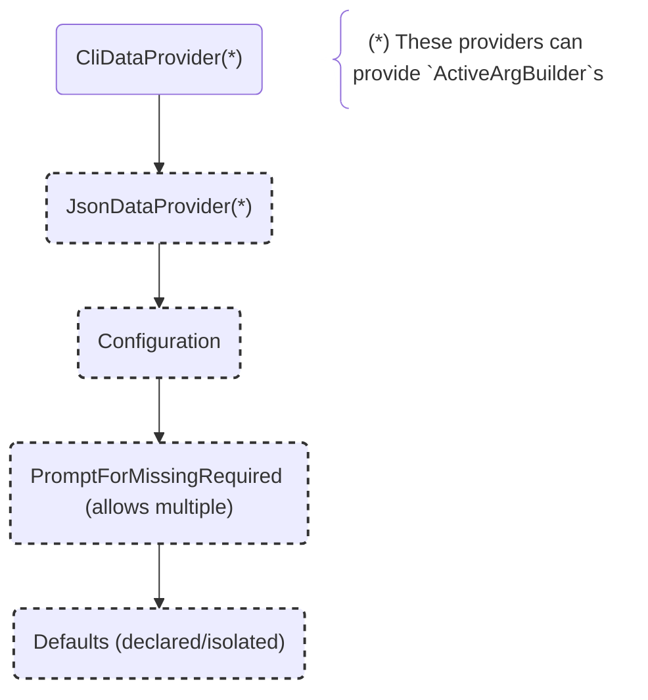
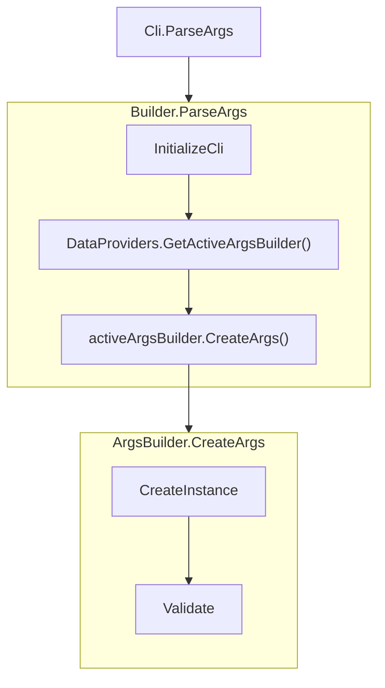

# Design drawings

## `DataProvider` flow

```mermaid
---
config:
  title: DataProviders
---
flowchart TD
  classDef mvp stroke:#333,stroke-width:2px,stroke-dasharray: 5 5;
  Cli("CliDataProvider(*)")
  Cli --> JsonScript("JsonDataProvider(*)"):::mvp
  JsonScript --> Config("Configuration"):::mvp
  Config --> Prompt("PromptForMissingRequired (allows multiple)"):::mvp
  Prompt --> Defaults("Defaults (declared/isolated)"):::mvp
   A@{ shape: comment, label: "(*) These providers can provide `ActiveArgBuilder`s" }
```

## Logic flow

```mermaid
graph TD
  Cli[Cli.ParseArgs]
  Cli --> Builder
  subgraph Builder[Builder.ParseArgs]
  direction TB
  InitCli[InitializeCli]
  InitCli --> GetActive["DataProviders.GetActiveArgsBuilder()"]
  GetActive --> CreateArgsCall["activeArgsBuilder.CreateArgs()"]
  end
  CreateArgsCall --> ArgsBuilder
  subgraph ArgsBuilder[ArgsBuilder.CreateArgs]
  direction TB
  CreateInstance
  CreateInstance --> Validate
  end
```