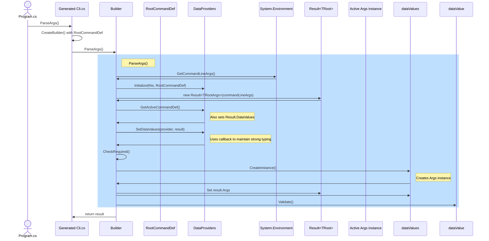

# Design drawings

## Sequence

`Args` is the programmer defined class that the implementing programmer will use after parsing. 

```mermaid
sequenceDiagram
    actor program as Program.cs
    %%participant Alice@{ "type" : "collections" }
    participant cli as Generated Cli.cs
    participant builder as Builder
    participant rootArgs as RootCommandDef
    participant providers as DataProviders
    participant env as System.Environment
    participant result as Result<TRoot>
    participant activeArgs as Active Args instance

    program->>cli: ParseArgs()
    cli->>cli: CreateBuilder() with RootCommandDef
    cli->>builder: ParseArgs()
    rect rgb(191, 223, 255)
    note right of builder:ParseArgs()
    builder->>env: GetCommandLineArgs()
    env->>builder: 
    builder->>providers: Initialize(this, RootCommandDef)
    builder->>result: new Result<TRootArgs>(commandLineArgs)
    result->>builder:
    builder->>providers: GetActiveCommandDef()
    note right of providers: Also sets Result.DataValues
    providers->>builder:
    builder->>providers: SetDataValues(provider, result)
    note right of providers: Uses callback to maintain strong typing
    providers->>builder:
    builder->>builder: CheckRequired()
    builder->>dataValues: CreateInstance()
    note right of dataValues: Creates Args instance
    dataValues->>builder:
    builder->>result: Set result.Args
    builder->>dataValues:
    builder->>dataValue: Validate()
    end
    builder->>cli: return result

```
