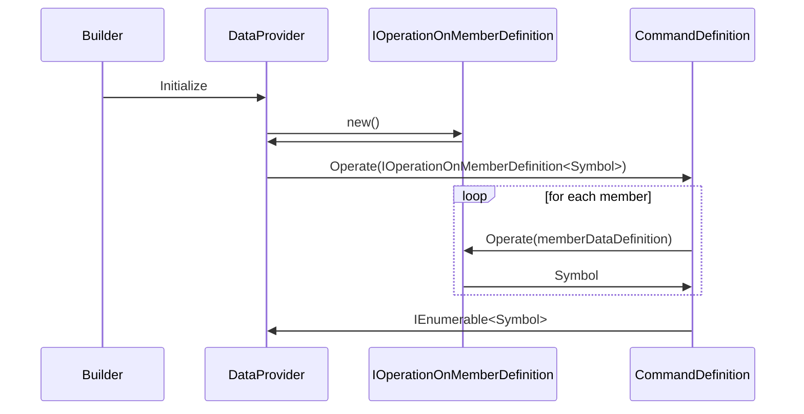

# Callback sequence diagram

```mermaid
sequenceDiagram
    participant builder as Builder
    participant provider as DataProvider
    participant operation  as IOperationOnMemberDefinition
    participant commandDef as CommandDefinition

    builder->>provider: Initialize
    provider->>operation: new()
    operation->>provider:
    provider->>commandDef: Operate(IOperationOnMemberDefinition<Symbol>)
    loop for each member
    commandDef->>operation: Operate(memberDataDefinition)
    operation->>commandDef: Symbol
    end
    commandDef->>provider: IEnumerable<Symbol>
```

